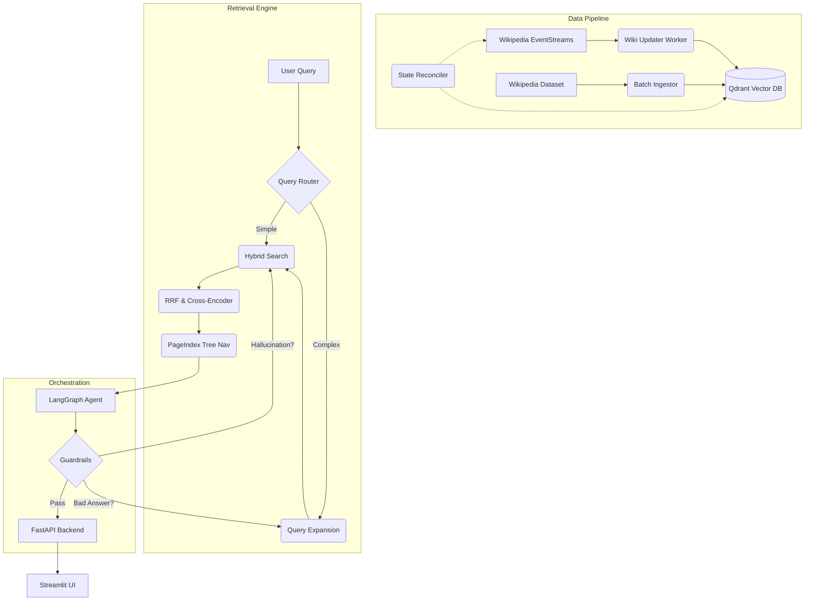

# WikiMind RAG Pipeline

WikiMind is a production-grade, end-to-end Tri-Brid Hybrid Agentic RAG pipeline. It features a self-healing knowledge base synced with live Wikipedia edits, advanced multi-hop retrieval, and an agentic orchestration layer using LangGraph.

## Architecture



## Features

| Feature | Description | Tech Stack |
|---------|-------------|------------|
| **Tri-Brid Retrieval** | Fuses Dense, Sparse (BM25), and structural PageIndex retrieval | Qdrant, FastEmbed |
| **Self-Healing Sync** | Listens to live Wikipedia edits via SSE to keep the vector DB fresh | aiohttp, SSE, MediaWiki API |
| **Agentic Loops** | LangGraph state machine with CRAG grading and Self-RAG reflection | LangGraph, Langchain |
| **Safe Generation** | Built-in output guardrails for hallucination detection | NeMo Guardrails |
| **Full Observability** | Distributed tracing and hardware metrics | Langfuse, Prometheus, Grafana |

## Quick Start

### Prerequisites
- Docker and Docker Compose
- API Keys: OpenAI, Tavily (optional), Langfuse (optional)

### Setup
1. Clone the repository
2. Copy `.env.example` to `.env` and fill in your API keys
3. Start the entire stack with one command:
```bash
make dev
```
4. Access the Streamlit UI at `http://localhost:8501`
5. Access Grafana at `http://localhost:3000` (admin/admin)

## API Reference

### `POST /chat`
Streams the agent's thought process and final answer.
**Request**:
```json
{
  "query": "What is the capital of France?",
  "strategies": {
    "multi_query": true,
    "hyde": false,
    "step_back": false,
    "decomposition": false,
    "page_index": true
  }
}
```

### `GET /health`
Returns the status and latency of infrastructure components (Qdrant, Redis, Langfuse).

## Roadmap
- [ ] Reverse image search integration
- [ ] Kubernetes Helm charts for cloud deployment
- [ ] Multi-modal document ingestion (PDF, Images)
